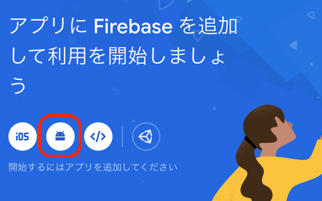
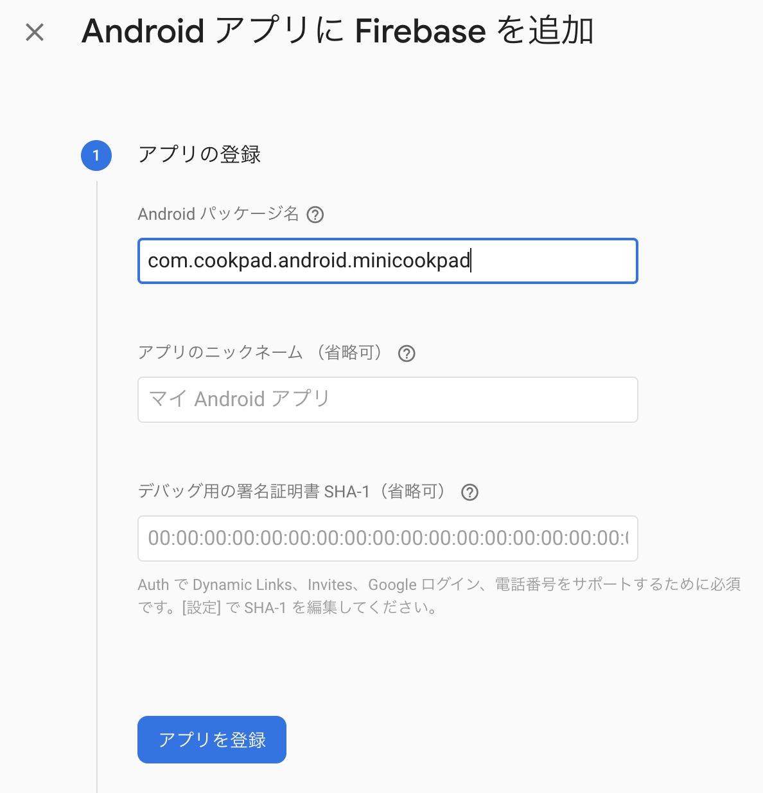

# MiniCookpad

クックパッド2020年夏インターン Android コース講義アプリ

[講義資料](https://speakerdeck.com/ksfee684/cookpad-summer-internship-2020-android)

## Setup

このプロジェクトを自身の GitHub アカウントに fork して利用してください。

### google-services.json

作成した Firebase プロジェクトのサービスをアプリから利用するために、事前準備で作成した Firebase プロジェクトにアプリを登録し、設定ファイルをリポジトリに追加します。

[console.firebase.google.com](https://console.firebase.google.com) から作成したプロジェクトを開き、左のメニューの一番上にある プロジェクトの概要 -> Android を選択します。



アプリの登録では、以下のように入力し アプリを登録 を選択します。

パッケージ名: `com.cookpad.android.minicookpad`
アプリのニックネーム: なんでも良い(空白のままでも可)
デバッグ用の署名証明書 SHA-1: 空白のままにする



`google-services.json をダウンロード` を選択し、JSONファイルをダウンロードします。
ダウンロードしたファイルはリポジトリの `app` 以下に配置してください。

**google-services.json は決してコミットに載せないでください**

ここまで完了したら、画面左上の × を選択し閉じてしまってください。

### エミュレータ

UI テストに利用するエミュレータをスクリプトで作成します。

```sh
./script/generate-emulator
```

`internship-test` というエミュレータが作成されますが、環境を統一するため起動する際は以下のコマンドを利用してください。

```sh
./script/launch-emulator
```
