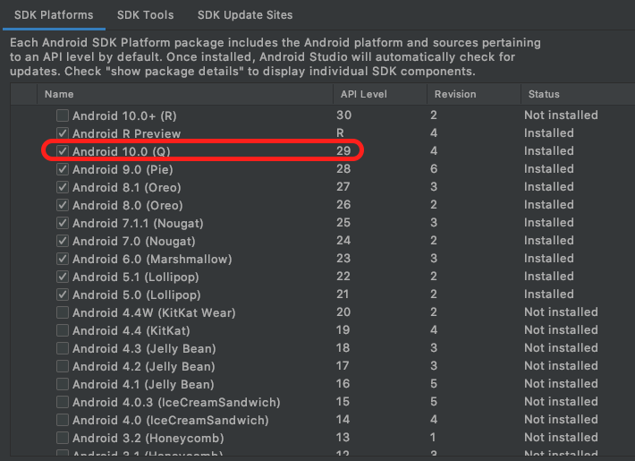
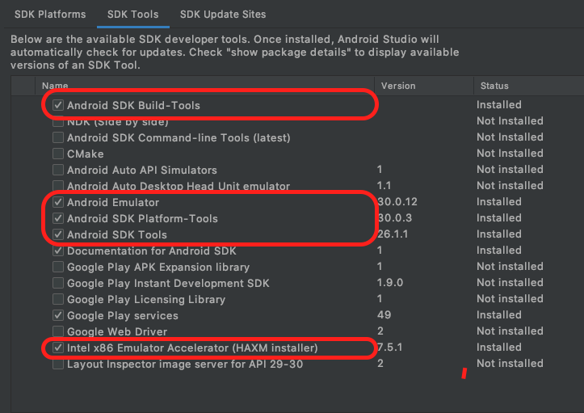
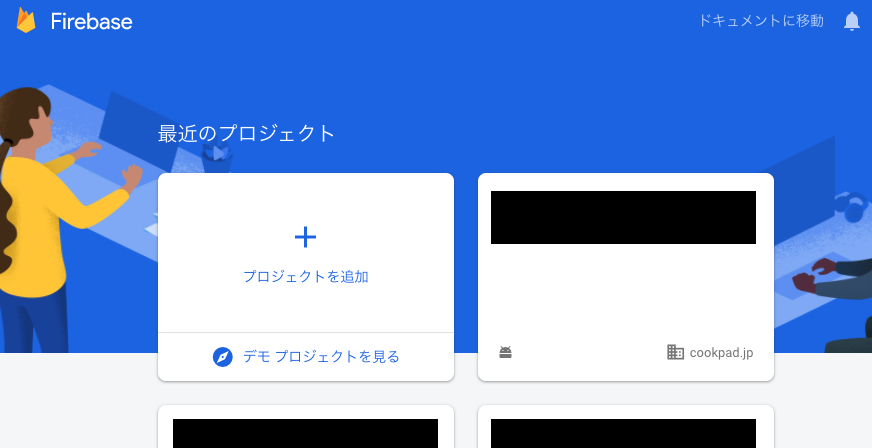
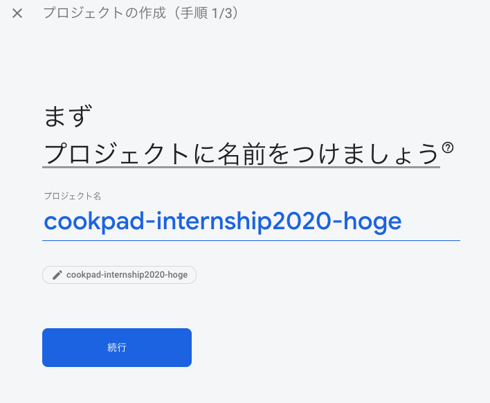
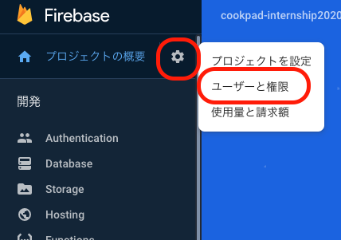
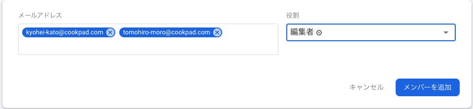
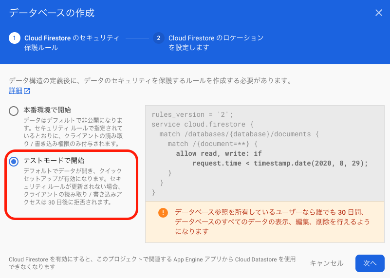
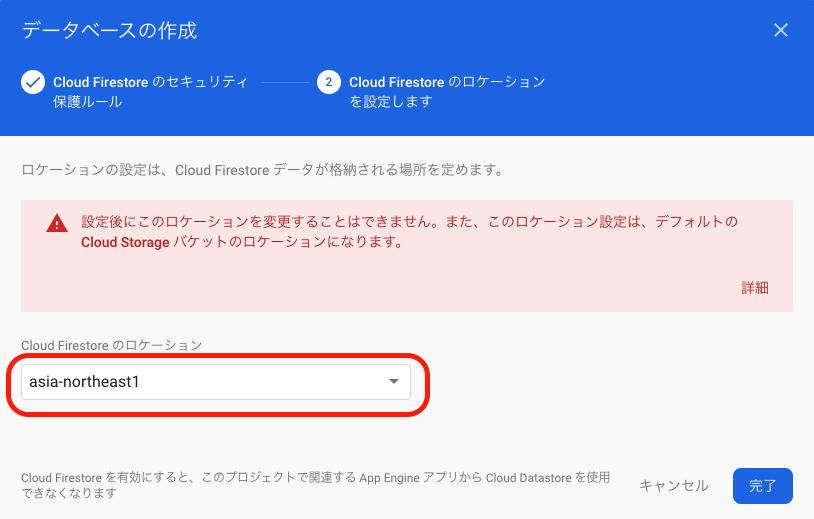
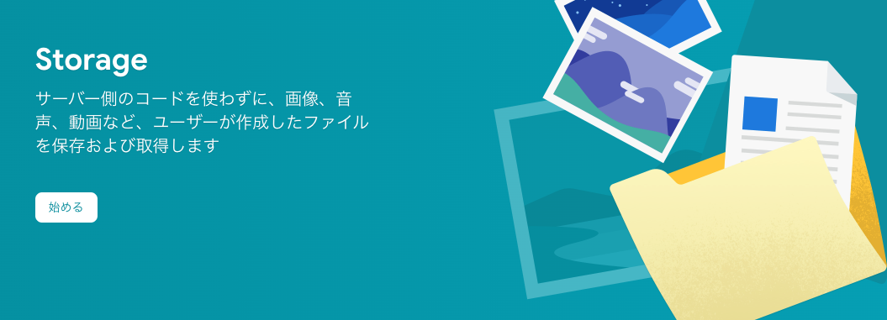
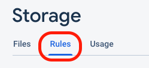

# クックパッドサマーインターン Android コース事前準備

以下の3つの内容についてそれぞれ事前準備をお願いします。

- Android Studio のセットアップ
- Firebase プロジェクトの準備
- 前提資料

## Android Studio のセットアップ

お使いの PC に Android Studio のインストールをされていない場合は[公式ページ](https://developer.android.com/studio)からインストールをお願いします。

既にインストールされている方でもバージョン4.0以降でない場合はアップデートをお願いします。

### ツール類のインストール

以下のツールを SDK Manager からインストールしてください。

- SDK Platform - Android 10.0(Q)
- Android SDK Build - Tools
- Android Emulator
- Android SDK Platform - Tools
- Android SDK Tools
- Intel x86 Emulator Accelerator(HAXM installer)
  - CPU アーキテクチャが異なる場合はそれぞれのハードウェアアクセラレータをインストールしてください






## Firebase プロジェクトの作成

今回のインターンシップではモバイル向けのバックエンドサービスとして [Firebase](https://firebase.google.com) を利用します。

以下の手順に沿って事前に Firebase プロジェクトの作成をお願いします。

### 1. Google アカウントの作成

Firebase プロジェクトは Google アカウントと紐付けられます。
もし Google アカウントをお持ちでない場合は、Google アカウントの作成をお願いします。

アカウントの作成方法は[公式ヘルプ](https://support.google.com/accounts/answer/27441)を参照してください。

### 2. Firebase プロジェクトの作成

次にインターンシップで利用する Firebase プロジェクトを作成します。

[console.firebase.google.com](https://console.firebase.google.com) にアクセスし、プロジェクトの追加を行ってください。



**※プロジェクトが1つも存在していない場合画像と表示が異なります**

プロジェクト名は `cookpad-internship-${name}` のように、最後にご自身の ID や名前を付け加えてください(一意に判断できるようなものであればなんでも構いません)。



Google アナリティクスの設定を聞かれますが、今回は利用しないため無効にしてください。

これでプロジェクトの作成がされます、作成までに少し時間がかかります。


### 3. メンバーの追加

皆さんのプロジェクトのセットアップを行うために、今回のインターンシップの講師及びTAをプロジェクトのメンバーとして追加してください。

プロジェクトの追加は左のメニューの `設定(歯車アイコン)` -> `ユーザと権限` から行えます。



メンバー追加画面から以下の2人を編集者(Editor)として追加してください。

- kyohei-kato@cookpad.com
- tomohiro-moro@cookpad.com



### 4. DB の作成

インターンシップで利用する Firestore の DB を作成してください。
左のメニューの `Database` -> `データベースを作成` から DB を作成できます。


DB を作成する際にアクセスルールの設定ができますが、今回はテストモードを選択してください。



次に作成する DB のロケーションが聞かれますが、`asia-northeast1`(東京)を選択して DB を作成してください。



### 5. Storage の作成

DB と同様に利用する Storage も同様に作成してください。
左のメニューの `Storage` -> `始める` から Storage を作成できます。



アクセスルールの確認とロケーションを確認した後に Storage を作成します。

Storage 作成後に DB と同様に期間中であれば認証機能を通さずにアクセスできるようにルールを以下のように変更してください。



```
rules_version = '2';
service firebase.storage {
  match /b/{bucket}/o {
    match /{allPaths=**} {
      allow read, write: if request.time < timestamp.date(2020, 8, 29);
    }
  }
}
```

## 前提資料

技術講義では Android アプリを作成する上で基礎的な内容に合わせて以下の内容の説明を省略するので、事前にドキュメントを読み進めておいてください。

- [ViewModel の概要](https://developer.android.com/topic/libraries/architecture/viewmodel)
- [LiveData の概要](https://developer.android.com/topic/libraries/architecture/livedata)
- [ViewBinding の概要](https://developer.android.com/topic/libraries/view-binding)
- [Navigation Component の概要](https://developer.android.com/guide/navigation/navigation-getting-started)