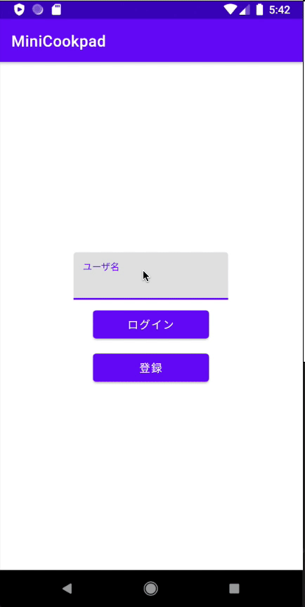
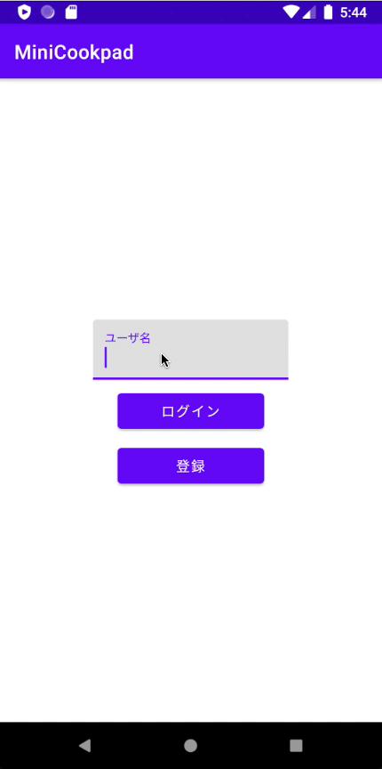
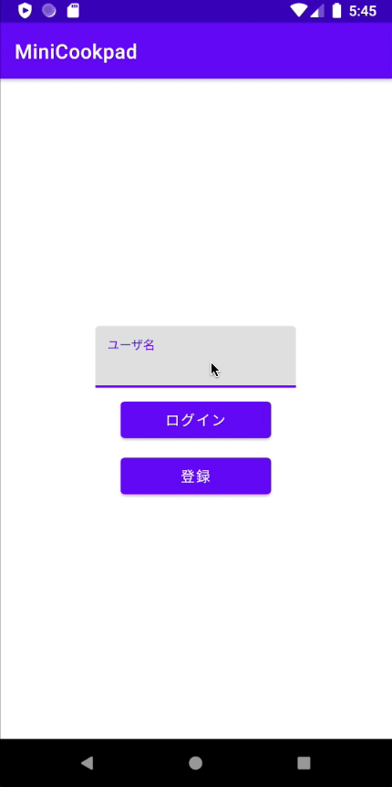
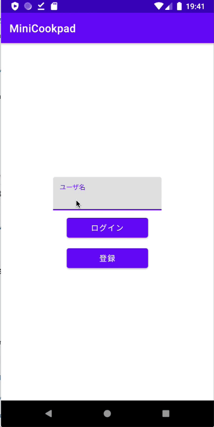
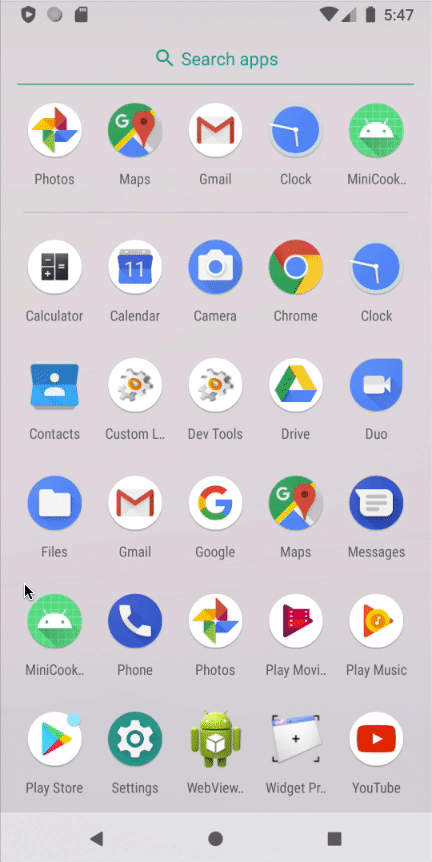

# 5. 発展課題

新しい概念 `DataStore` を使ってログイン/登録画面を実装してみましょう。

## 実装する機能

ユーザ名のみで認証を行うログイン/登録画面を実装してみましょう。
この画面で実装する機能は以下のとおりです。

- 既に登録されたユーザ名を入力してログインボタンを押すとログインしてレシピ一覧画面に遷移する
  - 存在しないユーザ名を入力するとトーストでログインに失敗したと伝えられる
- ユーザ名を入力して登録ボタンを押すと新しくユーザが作成され、作成したユーザにログインしてレシピ一覧画面に遷移する
  - 登録時にユーザ名の重複チェックはしなくても良いです
- ログインする際にユーザデータを SharedPreference に保存し、次回以降は自動的にログインする

| ログイン成功時 | ログイン失敗時 | 登録成功時 | 登録失敗時 | 自動ログイン |
|:--:|:--:|:--:|:--:|:--:|
|  |  |  |  |  |

この機能を実装する場合、ユーザデータの参照先をサーバ(Firestore)とローカル(SharedPreference)の2つを切り替えながら利用することになりますが、
クックパッドアプリではこのように DataSource を切り替えながら利用するレイヤーを `DataStore` として実装しています。

レイアウトファイル(fragment_login.xml)と LoginFragment は用意してあるのでそちらを利用してください。

## 実装手順

大まかな実装手順は以下のとおりです。

手順ごとにそれぞれヒントを用意しているので、実装に詰まったときには確認してください。

- NavGraph のスタートを書き換え
- Firestore 上でユーザ情報の取得と保存を行う DataSource を作成
  - RemoteUserDataSource として作成
- SharedPreference 上でユーザ情報の取得と保存を行う DataSource を作成
  - LocalUserDataSource として作成
- DataSource を切り替える DataStore を作成
- Contract と Entity を作成
- Presenter を作成
- Interactor を作成
- View を作成
- Routing を作成
- View, Presenter, Interactor, Routing の処理を接続

### NavGraph のスタートを書き換え

用意されているログイン/登録画面が表示されるように画面遷移のルートを書き換えましょう。

Navigation Component の遷移図を司る `main_nav_graph.xml` で、`app:startDestination` を `@id/loginFragment` に変更することで、アプリの起動画面が LoginFragment に切り替わります。
書き換えたら実際に表示されるかを確認してみましょう。

### Firestore 上でユーザ情報の取得と保存を行う DataSource を作成

マスタデータとなるサーバにユーザの存在チェックと登録を行う `RemoteUserDataSource` と、
その実装として Firestore へ接続する `FirebaseUserDataSource` を追加します。

具体的には以下のような実装となります。

```kotlin
// User.kt
data class User(
    val id: String? = null,
    val name: String
) {
    fun toMap(): Map<String, Any?> = mapOf(
        "name" to name
    )

    companion object {
        fun fromDocument(document: DocumentSnapshot): User =
            User(
                id = document.id,
                name = document["name"] as String
            )
    }
}

// RemoteUserDataSource.kt
interface RemoteUserDataSource {
    fun fetch(name: String, onSuccess: (User?) -> Unit, onFailed: (Throwable) -> Unit)

    fun save(user: User, onSuccess: (User) -> Unit, onFailed: (Throwable) -> Unit)
}

// FirebaseUserDataSource.kt
class FirebaseUserDataSource : RemoteUserDataSource {
    private val db = FirebaseFirestore.getInstance()

    override fun fetch(name: String, onSuccess: (User?) -> Unit, onFailed: (Throwable) -> Unit) {
        db.collection(COLLECTION_PATH)
            .whereEqualTo("name", name)
            .get()
            .addOnSuccessListener {
                it.documents.firstOrNull()?.let { document ->
                    onSuccess.invoke(User.fromDocument(document))
                } ?: onSuccess.invoke(null)
            }
            .addOnFailureListener(onFailed)
    }

    override fun save(user: User, onSuccess: (User) -> Unit, onFailed: (Throwable) -> Unit) {
        db.collection(COLLECTION_PATH)
            .add(user.toMap())
            .addOnSuccessListener { onSuccess.invoke(user.copy(id = it.id)) }
            .addOnFailureListener(onFailed)
    }

    private companion object {
        const val COLLECTION_PATH = "users"
    }
}
```

### SharedPreference 上でユーザ情報の取得と保存を行う DataSource を作成

自動ログインを行うため、端末内にキャッシュとして存在するデータを扱う `LocalUserDataSource` と、
その実装として SharedPreference を保存先とする `SharedPreferenceUserDataSource` を追加します。

```kotlin
// LocalUserDataSource.kt
interface LocalUserDataSource {
    fun fetch(): User?

    fun save(user: User, onSuccess: () -> Unit, onFailed: (Throwable) -> Unit)
}

// SharedPreferenceUserDataSource.kt
class SharedPreferenceUserDataSource(context: Context) : LocalUserDataSource {
    private val preference = context.getSharedPreferences(PREF_NAME, Context.MODE_PRIVATE)

    override fun fetch(): User? {
        val id = preference.getString(KEY_ID, null)
        val name = preference.getString(KEY_NAME, null)
        return if (id != null && name != null) {
            User(id, name)
        } else {
            null
        }
    }

    override fun save(user: User, onSuccess: () -> Unit, onFailed: (Throwable) -> Unit) {
        preference.edit {
            putString(KEY_ID, user.id)
            putString(KEY_NAME, user.name)
            onSuccess.invoke()
        }
    }

    private companion object {
        const val PREF_NAME = "LocalUserDataSource"
        const val KEY_ID = "user_id"
        const val KEY_NAME = "user_name"
    }
}
```

### DataSource を切り替える DataStore を作成

冒頭に合った自動ログイン機能を実現するためにはユーザデータを以下のように扱う必要があります。

- ローカルデータが存在すればローカルデータを、なければリモートのデータを参照する
- リモートからデータを取得できた場合にローカルに保存する

このInteractor からユーザデータを扱う際にはこういったデータの扱いを知る必要はないので、クックパッドアプリでは DataStore というレイヤーに切り出して隠蔽しています。

DataStore にはユーザデータの取得/登録に加えて自動ログインようにユーザ状態を確認するメソッドを追加しましょう。
具体的なインタフェースは以下のとおりです。

```kotlin
// UserDataStore.kt
interface UserDataStore {
    fun currentUser(): User? // 現在のユーザ状態(ログインしていなければ null)

    fun fetch(name: String, onSuccess: (User?) -> Unit, onFailed: (Throwable) -> Unit)

    fun register(user: User, onSuccess: () -> Unit, onFailed: (Throwable) -> Unit)
}
```

このインタフェースに対して DataSource を切り替えながら DataStore を実装してみましょう。

```kotlin
// UserDataStoreImpl.kt
class UserDataStoreImpl(
    private val localUserDataSource: LocalUserDataSource,
    private val remoteUserDataSource: RemoteUserDataSource
) : UserDataStore {
    override fun currentUser(): User? {
        // ローカルからデータを取得
    }

    override fun fetch(name: String, onSuccess: (User?) -> Unit, onFailed: (Throwable) -> Unit) {
        // サーバから情報を取得出来たらローカルにもデータを保存
    }

    override fun register(user: User, onSuccess: () -> Unit, onFailed: (Throwable) -> Unit) {
        // サーバに登録した後にローカルにもデータを保存
    }
}
```

### Contract と Entity を作成

空コンポーネントを定義した Contract と Entity を作成します。

Entity はユーザ名のみを持つデータクラスを宣言します。

### Presenter を作成

ログインと登録、自動ログインのタイミングで受け取るイベントをそれぞれ定義します。

ログインと登録のイベントは EditText に入力されたユーザ名を受け取る必要があります。

### Interactor を作成

先程作成した UserDataStore を利用して Presenter で定義したイベントに対応したメソッドをそれぞれ定義しましょう。

**ヒント**

<details>
```kotlin
interface Interactor {
    fun restoreUser(onSuccess: (User?) -> Unit, onFailed: (Throwable) -> Unit)
    fun loginUser(name: String, onSuccess: (User?) -> Unit, onFailed: (Throwable) -> Unit)
    fun registerUser(name: String, onSuccess: () -> Unit, onFailed: (Throwable) -> Unit)
}
```
</details>

### View を作成

ログイン/登録のそれぞれに対して成功/失敗時の UI 更新メソッドを定義しましょう。
それぞれ以下のような仕様で実装してください。

- ログイン成功時
  - `${ユーザ名} でログインしました` とトースト表示後にレシピ一覧に遷移
- ログイン失敗時
  - `ログインに失敗しました` とトースト表示
- 登録成功時
  - `登録が完了しました` とトースト表示後にレシピ一覧に遷移
- 登録失敗時
  - `登録に失敗しました` とトースト表示

**ヒント**

<details>
```kotlin
interface View {
    fun renderLoginUser(user: User?)
    fun renderLoginError(throwable: Throwable)
    fun renderRegisterUser()
    fun renderRegisterError(throwable: Throwable)
}
```
</details>

### Routing を作成

レシピ一覧に遷移するメソッドを定義しましょう。

レシピ一覧への遷移は他の画面遷移と同様に Navigation Component を利用して以下のように実装できます。

```kotlin
// LoginRouting.kt
class LoginRouting(
    private val fragment: LoginFragment
) : LoginContract.Routing {
    override fun navigateFinish() {
        fragment.findNavController().navigate(R.id.showRecipeList)
    }
}
```

### View, Presenter, Interactor, Routing の処理を接続

最後にこれまで実装した View, Interactor, Routing の処理を接続してみましょう。

Interactor を通してレシピ保存を行う際に適切に View のメソッドをコールバックとして渡しましょう。
成功した場合はレシピ一覧画面に遷移するので View のメソッド呼び出しと合わせて Routing のメソッドを呼び出す必要があります。

ここまで実装できたらアプリを起動してログイン/登録、自動ログインが出来ているか確認してみましょう。
